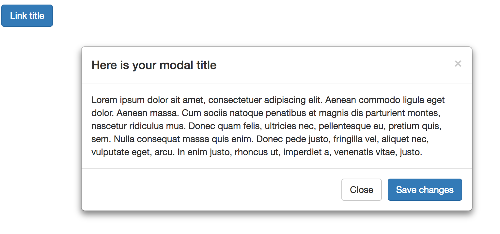

Developer documentation
=======================

Render patterns programmatically
--------------------------------

Patterns can be rendered programmatically by using the following syntax:

.. code-block:: php

   <?php
   $elements['quote'] = [
     '#type' => 'pattern',
     '#id' => 'blockquote',
     '#fields' => [
       'quote' => 'You must do the things you think you cannot do.',
       'attribution' => 'Eleanor Roosevelt'
     ]
   ];

   \Drupal::service('renderer')->render($elements);

The code above will produce the following result:

To render a specific pattern variant use:

.. code-block:: php

   <?php
   $elements['quote'] = [
     '#type' => 'pattern',
     '#id' => 'blockquote',
     '#variant' => 'highlighted',
     '#fields' => [
       'quote' => 'You must do the things you think you cannot do.',
       'attribution' => 'Eleanor Roosevelt'
     ]
   ];

It is also possible to just render a pattern preview as displayed on the patterns overview page in the following way
(since fields are already bundled within the pattern definition we don't need to re-declare them here):

.. code-block:: php

   <?php
   $elements['quote'] = [
     '#type' => 'pattern_preview',
     '#id' => 'blockquote',
   ];

   \Drupal::service('renderer')->render($elements);

Rendering the code above will produce the following output:

To render a specific pattern preview variant use:

.. code-block:: php

   <?php
   $elements['quote'] = [
     '#type' => 'pattern_preview',
     '#id' => 'blockquote',
     '#variant' => 'highlighted',
   ];

Render patterns using Twig functions
------------------------------------

The UI Patterns module also exposes two Twig functions to easily render patterns into your Twig templates.

The following two calls:

.. code-block:: twig

   {{ pattern('button', {title: 'Link title', url: 'http://example.com'}) }}
   {{ pattern_preview('modal') }}

Will print:

To render pattern variants use:

.. code-block:: twig

   {{ pattern('button', {title: 'Link title', url: 'http://example.com'}, 'highlighted') }}
   {{ pattern_preview('modal', 'highlighted') }}

Since patterns are rendered using the render element described above all libraries and preprocess hooks will be ran when
using Twig functions.

Working with pattern suggestions
--------------------------------

Modules that want to add theme hook suggestions to patterns can do that by implementing the following hook:

.. code-block:: php

   <?php
   /**
    * Provide hook theme suggestions for patterns.
    *
    * @see ui_patterns_theme_suggestions_alter()
    */
   function hook_ui_patterns_suggestions_alter(array &$suggestions, array $variables, PatternContext $context) {
     if ($context->isOfType('views_row')) {
       $hook = $variables['theme_hook_original'];
       $view_name = $context->getProperty('view_name');
       $display = $context->getProperty('display');

       $suggestions[] = $hook . '__views_row__' . $view_name;
       $suggestions[] = $hook . '__views_row__' . $view_name . '__' . $display;
     }
   }

The hook above is a ``hook_theme_suggestions_alter()`` specifically designed for patterns. The hook is invoked
with a ``PatternContext`` object that describes information on where the current pattern is being used.

Pattern suggestions can, for example, allow developers to use alternative pattern templates in specific contexts or to
"massage" data before it sent to the pattern by implementing fine-grained preprocess hooks.

The following suggestions are automatically exposed by the project's sub-modules:

.. code-block:: php

   <?php

   // Suggestions for patterns used as layouts.
   // @see ui_patterns_layouts_ui_patterns_suggestions_alter()
   $suggestions[] = $hook . '__layout';
   $suggestions[] = $hook . '__layout__' . $entity_type;
   $suggestions[] = $hook . '__layout__' . $entity_type . '__' . $bundle;
   $suggestions[] = $hook . '__layout__' . $entity_type . '__' . $view_mode;
   $suggestions[] = $hook . '__layout__' . $entity_type . '__' . $bundle . '__' . $view_mode;
   $suggestions[] = $hook . '__layout__' . $entity_type . '__' . $entity_id;

   // Suggestions for patterns used as Display Suite field templates.
   // @see ui_patterns_ds_ui_patterns_suggestions_alter()
   $suggestions[] = $hook . '__ds_field_template';
   $suggestions[] = $hook . '__ds_field_template__' . $field_name;
   $suggestions[] = $hook . '__ds_field_template__' . $field_name . '__' . $entity_type;
   $suggestions[] = $hook . '__ds_field_template__' . $field_name . '__' . $entity_type . '__' . $bundle;
   $suggestions[] = $hook . '__ds_field_template__' . $field_name . '__' . $entity_type . '__' . $view_mode;
   $suggestions[] = $hook . '__ds_field_template__' . $field_name . '__' . $entity_type . '__' . $bundle . '__' . $view_mode;

   // Suggestions for patterns used as field groups templates.
   // @see ui_patterns_field_group_ui_patterns_suggestions_alter()
   $suggestions[] = $hook . '__field_group';
   $suggestions[] = $hook . '__field_group__' . $group_name;
   $suggestions[] = $hook . '__field_group__' . $group_name . '__' . $entity_type;
   $suggestions[] = $hook . '__field_group__' . $group_name . '__' . $entity_type . '__' . $bundle;
   $suggestions[] = $hook . '__field_group__' . $group_name . '__' . $entity_type . '__' . $view_mode;
   $suggestions[] = $hook . '__field_group__' . $group_name . '__' . $entity_type . '__' . $bundle . '__' . $view_mode;

   // Suggestions for patterns used as Views row templates.
   // @see ui_patterns_views_ui_patterns_suggestions_alter()
   $suggestions[] = $hook . '__views_row';
   $suggestions[] = $hook . '__views_row__' . $view_name;
   $suggestions[] = $hook . '__views_row__' . $view_name . '__' . $display;

When rendering a variant the following suggestions will be available too:

.. code-block:: php

   <?php

   // Suggestions for patterns used as layouts.
   // @see ui_patterns_layouts_ui_patterns_suggestions_alter()
   $suggestions[] = $hook . '__variant_' . $variant . '__layout';
   $suggestions[] = $hook . '__variant_' . $variant . '__layout__' . $entity_type;
   $suggestions[] = $hook . '__variant_' . $variant . '__layout__' . $entity_type . '__' . $bundle;
   $suggestions[] = $hook . '__variant_' . $variant . '__layout__' . $entity_type . '__' . $view_mode;
   $suggestions[] = $hook . '__variant_' . $variant . '__layout__' . $entity_type . '__' . $bundle . '__' . $view_mode;
   $suggestions[] = $hook . '__variant_' . $variant . '__layout__' . $entity_type . '__' . $entity_id;

   // Suggestions for patterns used as Display Suite field templates.
   // @see ui_patterns_ds_ui_patterns_suggestions_alter()
   $suggestions[] = $hook . '__variant_' . $variant . '__ds_field_template';
   $suggestions[] = $hook . '__variant_' . $variant . '__ds_field_template__' . $field_name;
   $suggestions[] = $hook . '__variant_' . $variant . '__ds_field_template__' . $field_name . '__' . $entity_type;
   $suggestions[] = $hook . '__variant_' . $variant . '__ds_field_template__' . $field_name . '__' . $entity_type . '__' . $bundle;
   $suggestions[] = $hook . '__variant_' . $variant . '__ds_field_template__' . $field_name . '__' . $entity_type . '__' . $view_mode;
   $suggestions[] = $hook . '__variant_' . $variant . '__ds_field_template__' . $field_name . '__' . $entity_type . '__' . $bundle . '__' . $view_mode;

   // Suggestions for patterns used as field groups templates.
   // @see ui_patterns_field_group_ui_patterns_suggestions_alter()
   $suggestions[] = $hook . '__variant_' . $variant . '__field_group';
   $suggestions[] = $hook . '__variant_' . $variant . '__field_group__' . $group_name;
   $suggestions[] = $hook . '__variant_' . $variant . '__field_group__' . $group_name . '__' . $entity_type;
   $suggestions[] = $hook . '__variant_' . $variant . '__field_group__' . $group_name . '__' . $entity_type . '__' . $bundle;
   $suggestions[] = $hook . '__variant_' . $variant . '__field_group__' . $group_name . '__' . $entity_type . '__' . $view_mode;
   $suggestions[] = $hook . '__variant_' . $variant . '__field_group__' . $group_name . '__' . $entity_type . '__' . $bundle . '__' . $view_mode;

   // Suggestions for patterns used as Views row templates.
   // @see ui_patterns_views_ui_patterns_suggestions_alter()
   $suggestions[] = $hook . '__variant_' . $variant . '__views_row';
   $suggestions[] = $hook . '__variant_' . $variant . '__views_row__' . $view_name;
   $suggestions[] = $hook . '__variant_' . $variant . '__views_row__' . $view_name . '__' . $display;

Expose source field plugins
---------------------------

When using a pattern on a view or an entity display form we are provided with a set of possible patterns source fields
that we can map to our pattern destination fields. Available source fields depends on the context in which a pattern is
being configured.

Pattern source fields are provided by plugins of type ``@UiPatternsSource``.

For example, when a pattern is used as a Views row template then the ``UiPatternsSourceManager`` collects all plugins
annotated with ``@UiPatternsSource`` and tagged by ``views_row``. A context array describing the current view is then
passed to each of the ``@UiPatternsSource`` plugins.

In the example below we can see the actual implementation of such a system:

.. code-block:: php

   <?php

   namespace Drupal\ui_patterns_views\Plugin\UiPatterns\Source;

   use Drupal\ui_patterns\Plugin\PatternSourceBase;

   /**
    * Defines Views row pattern source plugin.
    *
    * @UiPatternsSource(
    *   id = "views_row",
    *   label = @Translation("Views row"),
    *   provider = "views",
    *   tags = {
    *     "views_row"
    *   }
    * )
    */
   class ViewsRowSource extends PatternSourceBase {

     /**
      * {@inheritdoc}
      */
     public function getSourceFields() {
       $sources = [];
       /** @var \Drupal\views\ViewExecutable $view */
       $view = $this->getContextProperty('view');
       foreach ($view->display_handler->getFieldLabels() as $name => $label) {
         $sources[] = $this->getSourceField($name, $label);
       }
       return $sources;
     }

   }

At the moment the available source plugin tags are the following:

- ``entity_display``: provided by the ``ui_patterns`` module and triggered on an entity display configuration page.
- ``ds_field_template``: provided by the ``ui_patterns_ds`` module and triggered when setting up a field template
  on an entity display configuration page.
- ``views_row``: provided by the ``ui_patterns_views`` module and triggered on a Views row setting pane.
- ``test``: provided by the ``ui_patterns_test`` module and used in tests.

Alter pattern configuration forms
---------------------------------

You can alter UI Patterns configuration forms by implementing ``hook_ui_patterns_display_settings_form_alter()``.

For example, the following implementation adds a CSS class input field to the pattern configuration:

.. code-block:: php

   <?php

   /**
    * Implements hook_ui_patterns_display_settings_form_alter().
    *
    * Add a css class name configuration option.
    */
    function my_module_ui_patterns_display_settings_form_alter(array &$form, array $configuration) {
      $setting_value = isset($configuration['class_name']) ? $configuration[$key] : '';
      $form['class_name'] = [
        '#type' => 'input',
        '#title' => t('Class name'),
      ];
    }

This hook alter forms that are built using the ``PatternDisplayFormTrait`` trait, meaning:

- Display Suite field templates
- Field groups
- Views

If you want to alter an entity layout form that uses UI Patters for its layout use
``hook_ui_patterns_layouts_display_settings_form_alter()`` instead, for example:

.. code-block:: php

   <?php

   /**
    * Implements hook_ui_patterns_layouts_display_settings_form_alter().
    *
    * Add a css class name configuration option.
    */
    function hook_ui_patterns_layouts_display_settings_form_alter(array &$form, PatternDefinition $definition, array $configuration) {
      $class_name = isset($configuration['class_name']) ? $configuration['class_name'] : '';
      $form['class_name'] = [
        '#type' => 'input',
        '#title' => t('Class name'),
      ];
    }
