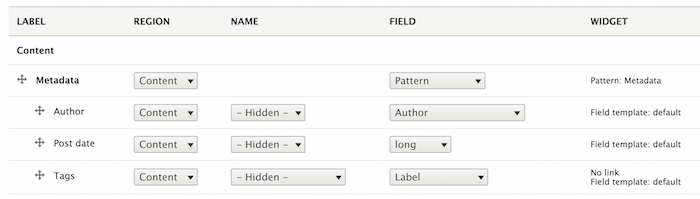
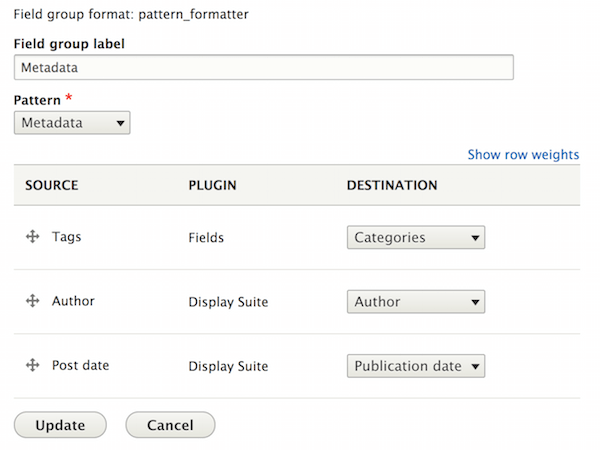

Use patterns with Field Groups
==============================

Patterns can be used to style entities' `field groups <https://www.drupal.org/project/field_group>`_ thanks to the
``ui_patterns_field_group`` module.

For example, say we want to show some metadata associated with an article, such as author, post date and tags.

After enabling the module we create a new field group of type **Pattern** and drag all fields you want to use in that
group, as shown below:

Once all fields are in place we access the field group settings and choose the **Metadata** pattern. At this point we
map the fields to the pattern destination fields and save our settings:

Articles will now always use the **Metadata** pattern to style that field group, as shown below:

.. image:: ../images/fieldgroup-3.png
   :align: center
   :width: 550

