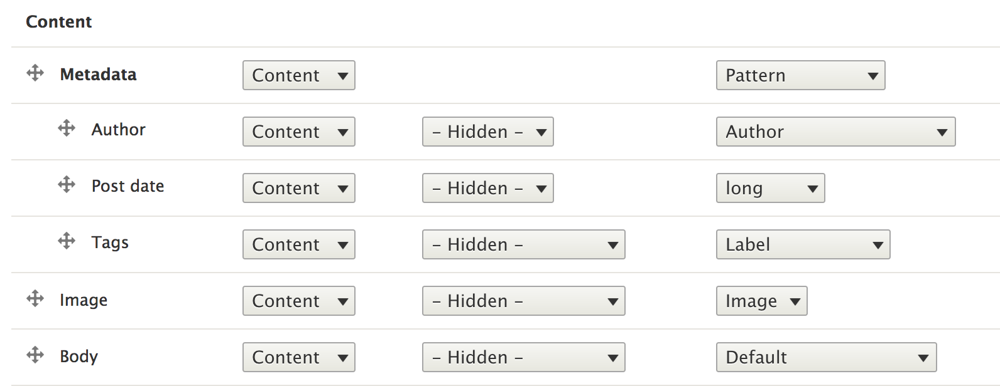
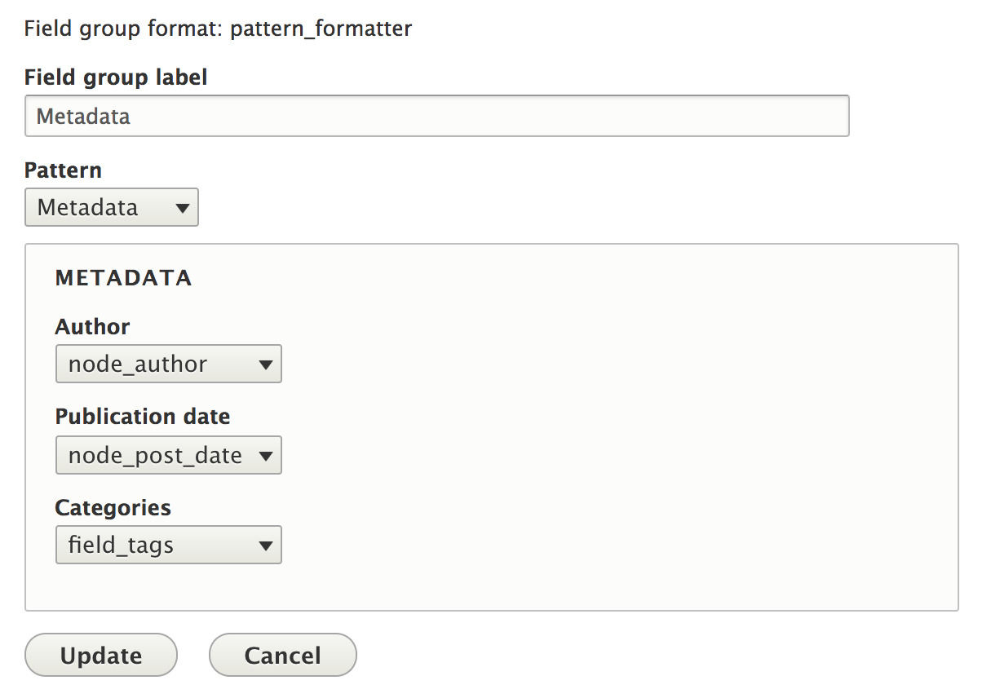
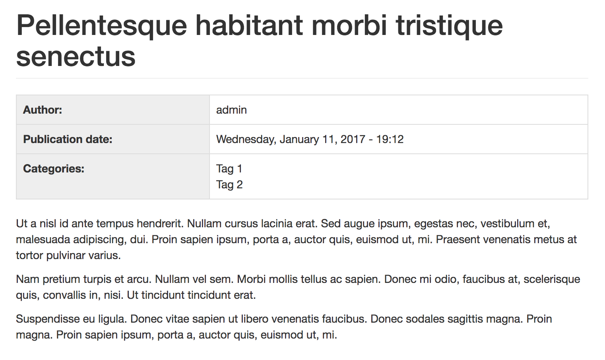

Use patterns in field groups
----------------------------

Patterns can be used to style your entities' `field groups <https://www.drupal.org/project/field_group>`_ thanks to the
``ui_patterns_field_group`` module shipped with the project.

After enabling the module create a new field group of type **Pattern** and drag all fields you want to use in that field group.

In the example below we want to show some metadata associated with an article, such as author, post date and tags:

After doing that open the field group settings, choose which pattern you which to use to render the metadata and
map the fields you just moved within the field group with the pattern's field:

Articles will now use the metadata pattern to style that field group:

