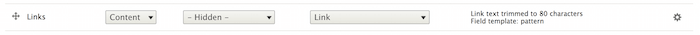
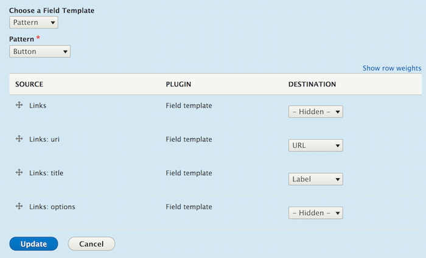
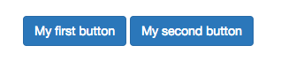

Use patterns with Field templates
=================================

Patterns can be used as Display Suite field templates by enabling the ``ui_patterns_ds`` module. This opens the
following interesting possibilities:

- Link fields can be styled as buttons by mapping their URL and link titles to specific pattern destinations.
- Image fields can be styled as an "image with caption" by mapping a formatted image and title to specific pattern
  destinations.

Let's see how to implement the first example having the following pattern definition:

.. code-block:: yaml

   button:
     label: Button
     description: A simple button.
     fields:
       title:
         type: text
         label: Label
         description: The button label
         preview: Submit
       url:
         type: text
         label: URL
         description: The button URL
         preview: http://example.com

On the entity display setting page we access the link field setting by clicking on the gear icon:

Then, after selecting the **Pattern** field template and the **Button** pattern, we map the link field columns to the
pattern's fields defined above:

Our multi-valued link field will then be formatted as follow:

