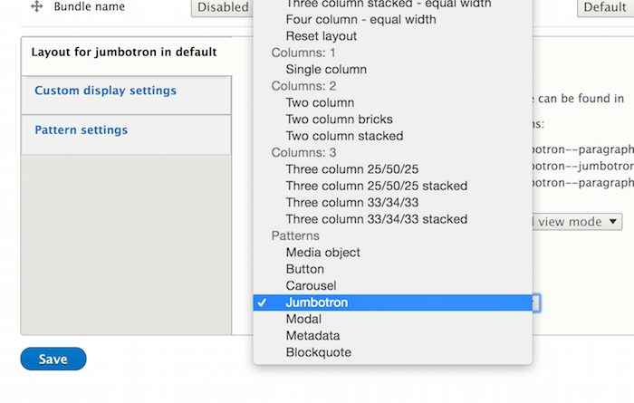
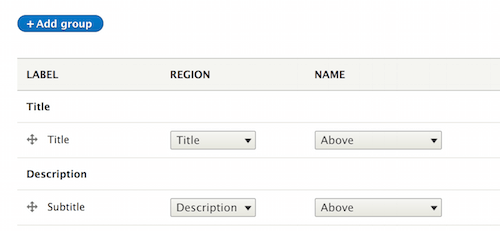
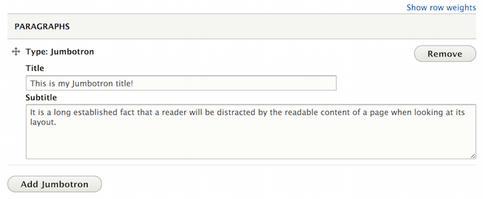
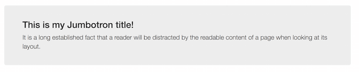

Use patterns as layouts
=======================

Patterns can be used as layouts thanks to the ``ui_patterns_layouts`` module.

Once exposed as layouts patterns can be used to arrange fields on entities like nodes,
`paragraphs <https://www.drupal.org/project/paragraphs>`_, etc. or to place blocks on a page using
`Panels <https://www.drupal.org/project/panels>`_.

In the example below we will style a **Jumbotron** paragraph using the Jumbotron paragraph.

Once on the paragraph **Manage display** page we choose the **Jumbotron** pattern as layout:

After doing that the pattern fields will be exposed as layout regions, so given the following definition:

.. code-block:: yaml

   jumbotron:
     label: Jumbotron
     description: A lightweight, flexible component that can optionally extend the entire viewport to showcase key content on your site.
     fields:
       title:
         type: text
         label: Title
         description: Jumbotron title.
         preview: Hello, world!
       subtitle:
         type: text
         label: Description
         description: Jumbotron description.
         preview: This is a simple hero unit, a simple jumbotron-style component for calling extra attention to featured content or information.

We will get the following layout regions:

We can now arrange the paragraph fields on the layout and save our settings.

The paragraph below:

will be now styled using the **Jumbotron** pattern as follows:

