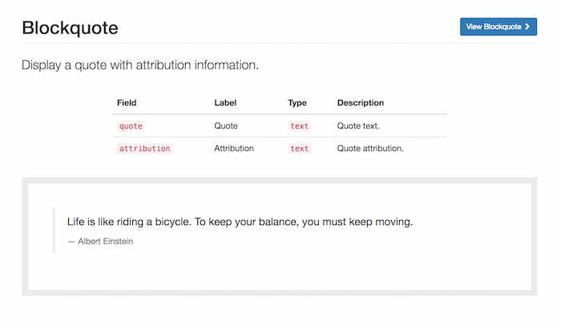

Define your patterns
====================

Patterns can be exposed by both modules and themes by enabling the ``ui_patterns_library`` module.

Defined patterns will be available at ``/patterns``, only accessible by roles having the ``access patterns page``
permission. Below an example of a pattern library page styled using the `Bootstrap Patterns <https://github.com/nuvoleweb/bootstrap_patterns>`_
theme:

.. image:: ../images/pattern-library.png
   :align: center

Pattern definitions
-------------------

To define your patterns simply create a YAML file named ``MY_MODULE.ui_patterns.yml`` or ``MY_THEME.ui_patterns.yml``
and list them using the following format:

.. code-block:: yaml

   blockquote:
     label: Blockquote
     description: Display a quote with attribution information.
     fields:
       quote:
         type: text
         label: Quote
         description: Quote text.
         preview: Life is like riding a bicycle. To keep your balance, you must keep moving.
       attribution:
         type: text
         label: Attribution
         description: Quote attribution.
         preview: Albert Einstein
     libraries:
       - MY_MODULE/module_library_one
       - MY_MODULE/module_library_two
       - pattern_library_one:
          css:
            component:
              css/my_component.css: {}
              http://example.com/external.min.css: { type: external, minified: true }
       - pattern_library_two:
          js:
            js/library_two.js: {}
          dependencies:
            - core/jquery

Let's break this down:

``id``
    The root of a new pattern definition (``blockquote`` in the example above). It must contain only lowercase
    characters, numbers and underscores (i.e. it should validate against ``[^a-z0-9_]+``).
``label``
    Pattern label, used on pattern library page.
``description``
    Pattern description, used on pattern library page.
``fields``
    Hash defining the pattern fields. Each field must have the following properties defined below.

    ``type``
        Field type, can be ``text``, ``numeric``, etc. at the moment only used for documentation purposes.
    ``label``
        Field label, used on pattern library page.
    ``description``
        Field description, used on pattern library page.
    ``preview``
        Preview content, used on pattern library page. It can be either a string or a Drupal render array, in which case
        we can use keys like ``type: processed_text`` or ``theme: image``.

``libraries``
    List of libraries to be loaded when rendering the pattern. UI patterns are supposed to be self-contained so they
    should define along all needed libraries.

Once the pattern is defined the module will expose them as standard Drupal theme definitions.

For example, given the ``my_pattern`` pattern ID then a theme function ``pattern_my_pattern`` is created and,
consequently, the module will look for a template file called  ``pattern-my-pattern.html.twig``.

Once the pattern is defined it's time to provide its `Twig <http://twig.sensiolabs.org/>`_ template. In order to do so
we create a Twig file called ``pattern-blockquote.html.twig`` and we place it either under ``MY_MODULE/templates``,
if the pattern is exposed by a module, or under ``MY_THEME/templates``, if it is exposed by a theme. Obviously themes
can always override templates exposed by modules.

For example, a blockquote Twig template file ``pattern-blockquote.html.twig`` could look like the following:

.. code-block:: twig

    <blockquote>
      
{{ quote }}

      <footer>{{ attribution }}</footer>
    </blockquote>

The ``blockquote`` pattern defined above will be rendered in the pattern library as shown below (styled using the
`Bootstrap <https://www.drupal.org/project/bootstrap>`_ theme):

**Remember**: we can always visit the ``/pattern`` page in order to have access to a full preview of all our patterns.

Organize your patterns in sub-folders
-------------------------------------

Patterns can be defined using a single ``NAME.ui_patterns.yml`` file. However, in case of sites with a large number of
patterns, this might quickly becomes difficult to manage.

Luckily pattern definitions can be organised in sub-folders too, as shown below:

.. code-block:: bash

    .
    ├── templates
    │   └── patterns
    │       ├── button
    │       │   ├── button.ui_patterns.yml
    │       │   └── pattern-button.html.twig
    │       ├── media
    │       │   ├── media.ui_patterns.yml
    │       │   └── pattern-media.html.twig
    ...
    │       └── pattern-jumbotron.html.twig
    ├── ui_patterns_test_theme.info.yml
    └── ui_patterns_test_theme.ui_patterns.yml

**Note:** the example above is taken by the actual test target site that is used to test the module itself: have a look
at ``./tests/README.md`` and at ``./tests/target/custom`` for working examples on how to use the UI Patterns module.

Expose pattern assets as libraries
----------------------------------

In case you wish to bundle your assets within the pattern directory you can define libraries with the alternative syntax
below:

.. code-block:: yaml

     blockquote:
       label: Blockquote
       ...
       libraries:
         ...
         - pattern_library_one:
            css:
              component:
                css/my_component.css: {}
                http://example.com/external.min.css: { type: external, minified: true }
         - pattern_library_two:
            js:
              js/library_two.js: {}

Libraries defined as above will be automatically loaded when the pattern is rendered. They are also exposed as ordinary
Drupal libraries as follows: ``ui_patterns/PATTERN_ID.LIBRARY_NAME``

For example, the two local libraries above can be attached to your render arrays in the following way:

.. code-block:: php

   <?php
   $build['#attached']['library'][] = 'ui_patterns/blockquote.pattern_library_one';
   $build['#attached']['library'][] = 'ui_patterns/blockquote.pattern_library_two';

Override patterns behavior
--------------------------

The default behavior can be changed by using the following properties in you pattern definitions:

``theme hook``
    If specified it overrides the default ``pattern_[id]`` theme hook with the provided value; the template file will
    change accordingly.
``template``
    If specified it overrides only the template file keeping the default ``pattern_[id]`` theme hook.
``use``
    If specified it will use a stand-alone Twig file as template. The value supports
    `Twig namespaces <http://symfony.com/doc/current/templating/namespaced_paths.html>`_, so the following notations
    are valid examples:

.. code-block:: yaml

   use: "@my_module/templates/my-template.html.twig"

.. code-block:: yaml

   use: "@molecules/media/media-block.twig"

The possibility of using stand-alone Twig templates allows for a swift integration with tools like
`PatternLab <http://patternlab.io/>`_ or modules like `Component Libraries <https://www.drupal.org/project/components>`_.

**Attention:** always remember to double-quote ``use:`` values or some YAML parsers (including PatternLab's) will
complain.
