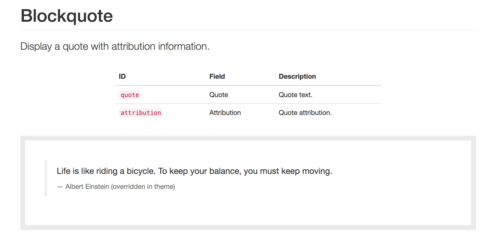

Define your patterns
--------------------

UI patterns can be exposed by both modules and themes: all defined patterns are collected and managed by a centralized
UI Pattern plugin manager, this means that pattern IDs must be unique in order to avoid conflicts.

Pattern plugins are described using the `YAML discovery method <https://www.drupal.org/docs/8/api/plugin-api/d8-plugin-discovery>`_.
To define your patterns simply create a YAML file named ``MY_MODULE.ui_patterns.yml`` or ``MY_THEME.ui_patterns.yml``
and list them using the following format:

.. code-block:: yaml

   blockquote:
     label: Blockquote
     description: Display a quote with attribution information.
     fields:
       quote:
         type: text
         label: Quote
         description: Quote text.
         preview: Life is like riding a bicycle. To keep your balance, you must keep moving.
       attribution:
         type: text
         label: Attribution
         description: Quote attribution.
         preview: Albert Einstein
     libraries:
       - MY_MODULE/library-1
       - MY_MODULE/library-2

Let's break this down:

``id``
    The root of a new pattern definition (``blockquote`` in the example above). It must contain only lowercase
    characters, numbers and underscores (i.e. it should validate against ``[^a-z0-9_]+``).
``theme hook``
    If specified it overrides the default ``pattern__[id]`` theme hook.
``label``
    Pattern label, used on pattern library page.
``description``
    Pattern description, used on pattern library page.
``fields``
    Hash defining the pattern fields. Each field must have the following properties defined below.

    ``type``
        Field type, can be ``text``, ``numeric``, etc. at the moment only used for documentation purposes.
    ``label``
        Field label, used on pattern library page.
    ``description``
        Field description, used on pattern library page.
    ``preview``
        Preview content, used on pattern library page. It can be either a string or a Drupal render array.

``libraries``
    Libraries that are to be loaded when rendering the pattern. UI patterns are supposed to be self-contained so they
    should define along all needed libraries.

Once the pattern is defined it's time to provide its [Twig](http://twig.sensiolabs.org/) template. In order to do so
we create a Twig file called ``pattern--blockquote.html.twig`` and we place it either under ``MY_MODULE/templates``,
if the pattern is exposed by a module, or under ``MY_THEME/templates``, if it is exposed by a theme. Obviously themes
can always override templates exposed by modules.

The blockquote Twig template file ``pattern--blockquote.html.twig`` could look something like this:

.. code-block:: twig

    <blockquote>
      
{{ quote }}

      <footer>{{ attribution }}</footer>
    </blockquote>

The ``blockquote`` pattern defined above will be rendered in the pattern library as follow (styled using Bootstrap theme):

