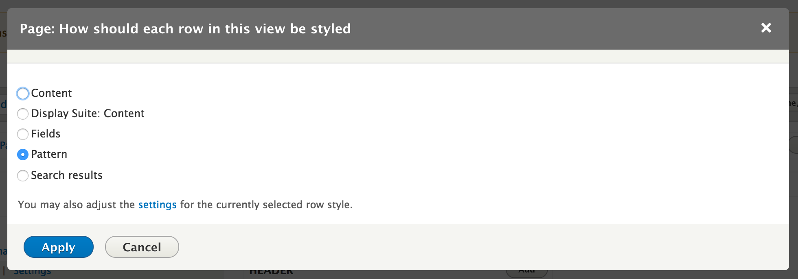
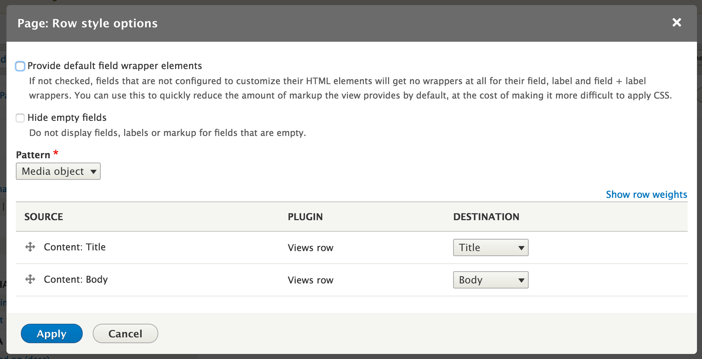

Use patterns with Views
-----------------------

Patterns can be used as Views row templates thank to the ``ui_patterns_views`` module by using the **Patterns** row
style plugin available on your views UI after enabling the module:

After selecting the pattern row plugin add some fields to the view display and, once done, access the row plugin's
settings pane:

Here you can the current views display's field to the selected pattern destination fields.
