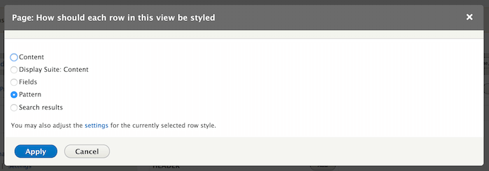
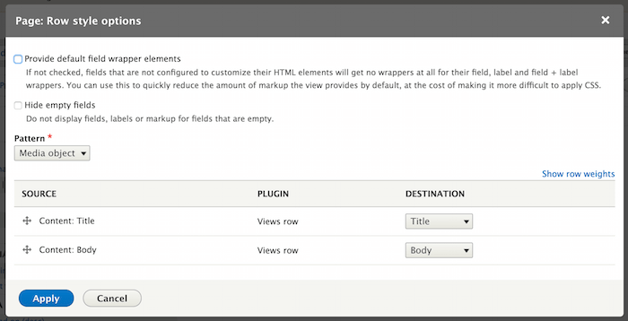

Use patterns with Views
-----------------------

Patterns can be used as Views row templates thanks to the ``ui_patterns_views`` module, which exposes a **Patterns** row
style plugin.

After choosing the **Pattern** row style plugin we can map the current Views display fields to the chosen pattern
destinations, as shown below:

Views rows will now be styled using the selected pattern.
