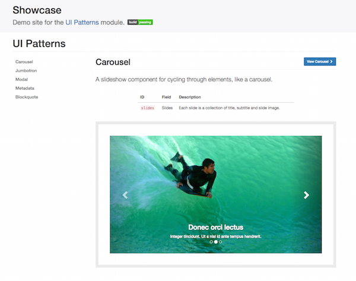

Welcome to UI Patterns' documentation
=====================================

The UI Patterns module allows developers to define self-contained UI patterns as Drupal plugins and use them seamlessly
in their `panels <https://www.drupal.org/project/panels>`_, `field groups <https://www.drupal.org/project/field_group>`_
or `Display Suite <https://www.drupal.org/project/ds>`_  view modes.

The module also generates a pattern library page to be used as documentation for content editors or as a showcase
for business like the one shown below:

Project overview
----------------

The UI Patterns project provides 3 modules:

* **UI Patterns** (machine name ``ui_patterns``): the main module that defines the UI Pattern plugin type and integrates
  defined patterns with Drupal's theme system.
* **UI Patterns Field Group** (machine name ``ui_patterns_field_group``): allows to use patterns to format field groups
  provided by the `Field group <https://www.drupal.org/project/field_group>`_ module.
* **UI Patterns Layouts** (machine name ``ui_patterns_layouts``): allows to use patterns as layouts provided by the
  `Layout plugin <https://www.drupal.org/project/layout_plugin>`_ module. This allows patterns to be used on
  `Display Suite <https://www.drupal.org/project/ds>`_  view modes or on `panels <https://www.drupal.org/project/panels>`_
  out of the box.

.. toctree::
   :caption: Table of Contents

   content/patterns-definition
   content/field-group
   content/layout-plugin
   content/view-modes

