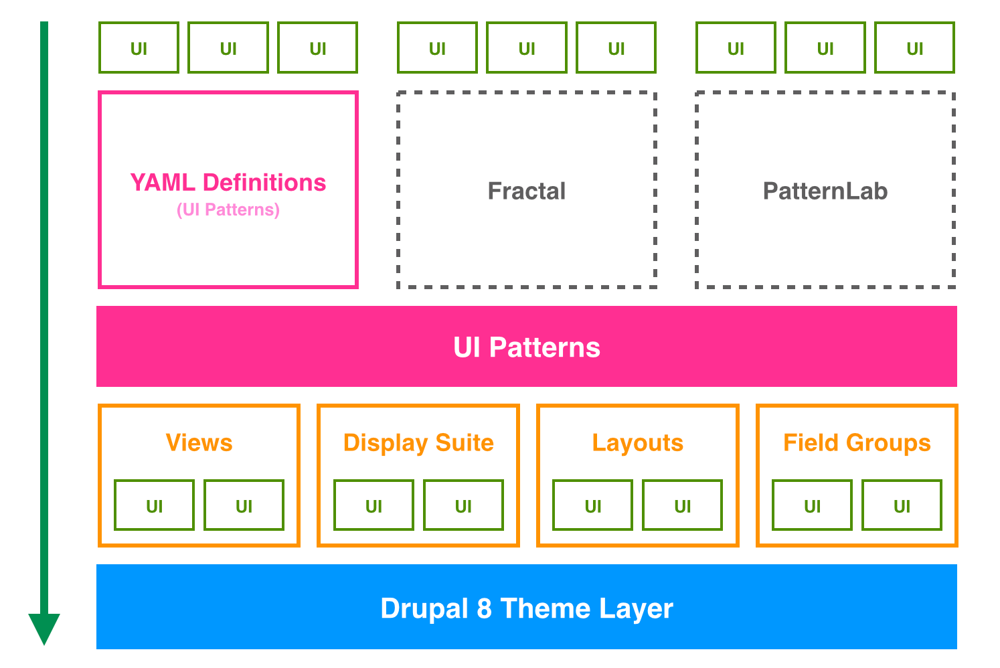

Welcome to UI Patterns' documentation
=====================================

The UI Patterns module allows developers to define self-contained UI patterns as Drupal plugins and use them seamlessly
in their `panels <https://www.drupal.org/project/panels>`_, `field groups <https://www.drupal.org/project/field_group>`_
or `Display Suite <https://www.drupal.org/project/ds>`_  view modes.

Project overview
----------------

The UI Patterns project provides 6 modules:

* **UI Patterns**: the main module, it exposes the UI Patterns system APIs and it does not do much more than that.
* **UI Patterns Library**: allows to define patterns via YAML and generates a pattern library page available at ``/patterns``
  to be used as documentation for content editors or as a showcase for business. Use this module if you don't plan to
  use more advanced component library systems such as PatternLab or Fractal.
  `Learn more <http://ui-patterns.readthedocs.io/en/8.x-1.x/content/patterns-definition.html>`_
* **UI Patterns Field Group**: allows to use patterns to format field groups
  provided by the `Field group <https://www.drupal.org/project/field_group>`_ module.
* **UI Patterns Layouts**: allows to use patterns as layouts. This allows patterns to be used on
  `Display Suite <https://www.drupal.org/project/ds>`_  view modes or on `panels <https://www.drupal.org/project/panels>`_
  out of the box.
* **UI Patterns Display Suite**: allows to use patterns to format `Display Suite <https://www.drupal.org/project/ds>`_
  field templates.
* **UI Patterns Views**: allows to use patterns as Views row templates.

By the way plugin definitions are handled the UI Patterns module also integrates with with tools like
`PatternLab <http://patternlab.io/>`_ or modules like `Component Libraries <https://www.drupal.org/project/components>`_.

Try it out
^^^^^^^^^^

Download and install the `Bootstrap Patterns <https://github.com/nuvoleweb/bootstrap_patterns>`_ theme on a vanilla
Drupal 8 installation to quickly try out the UI Patterns module.

.. toctree::
   :caption: Table of Contents

   content/patterns-definition
   content/field-group
   content/layout-plugin
   content/field-templates
   content/views
   content/developer-documentation
   content/tests

